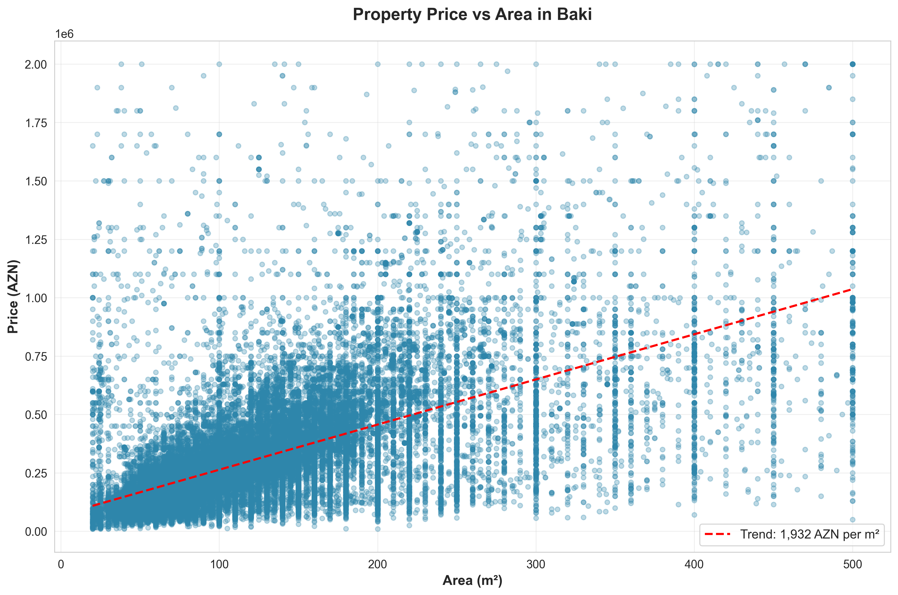
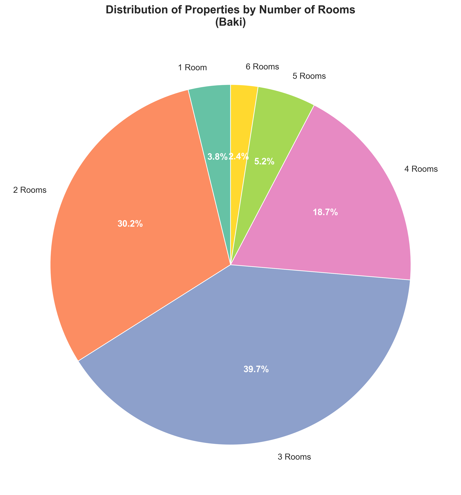
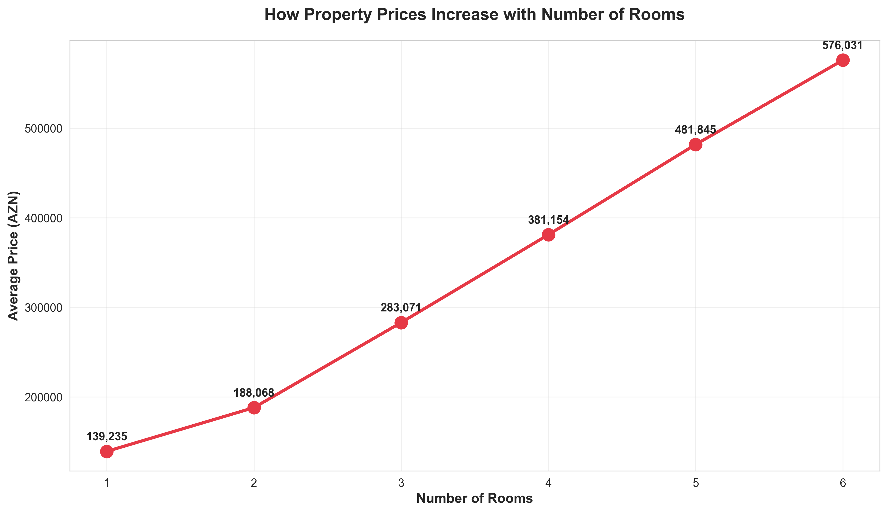
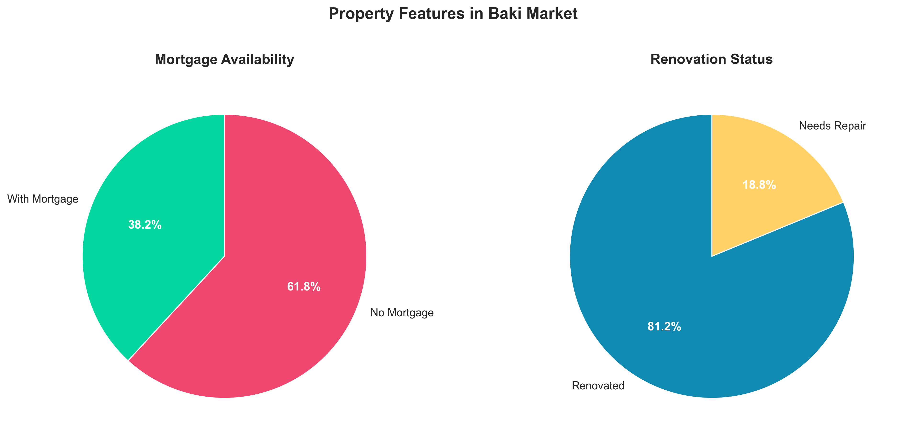
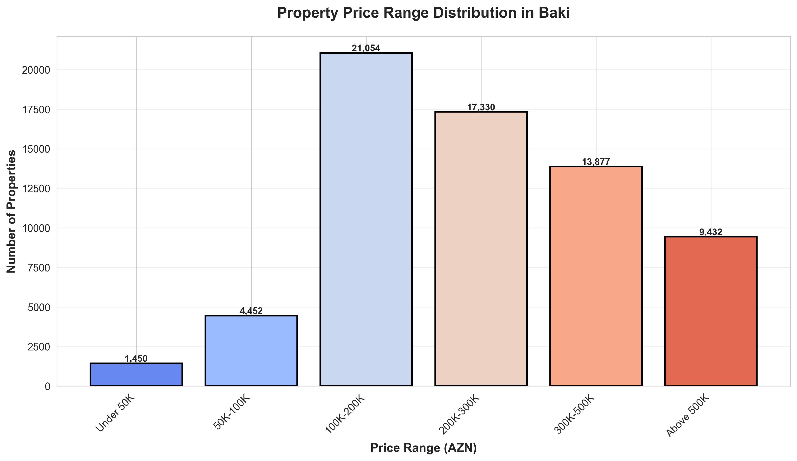
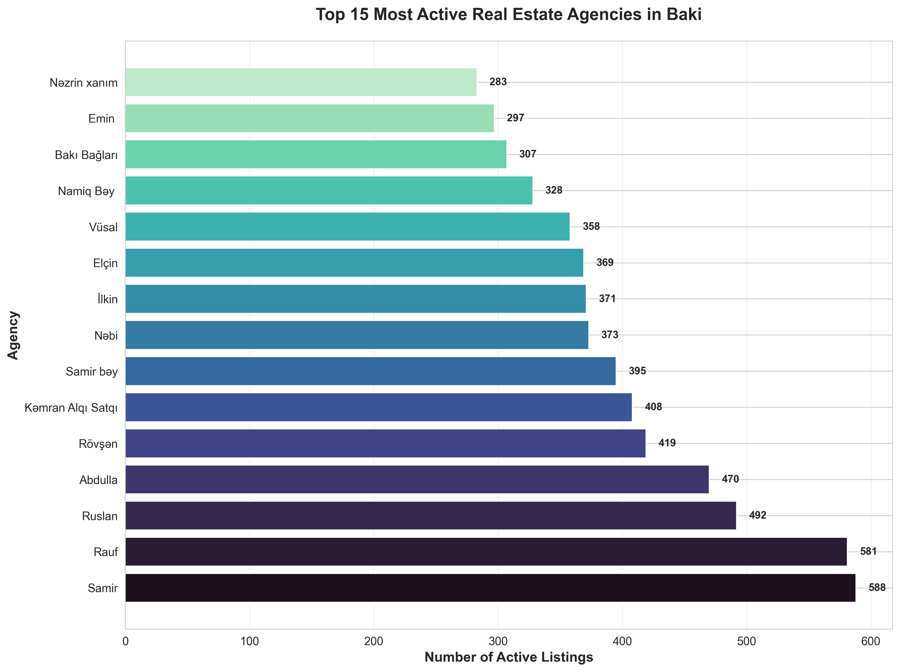
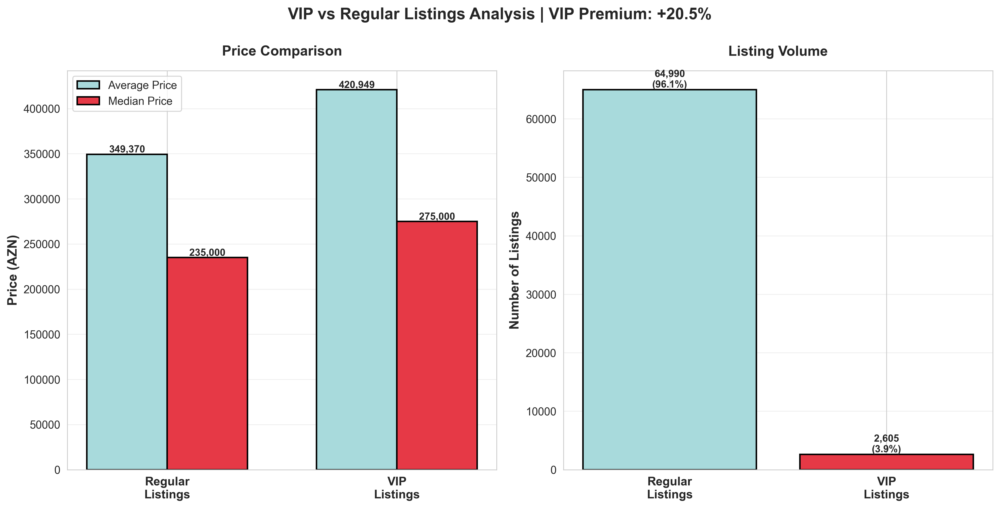
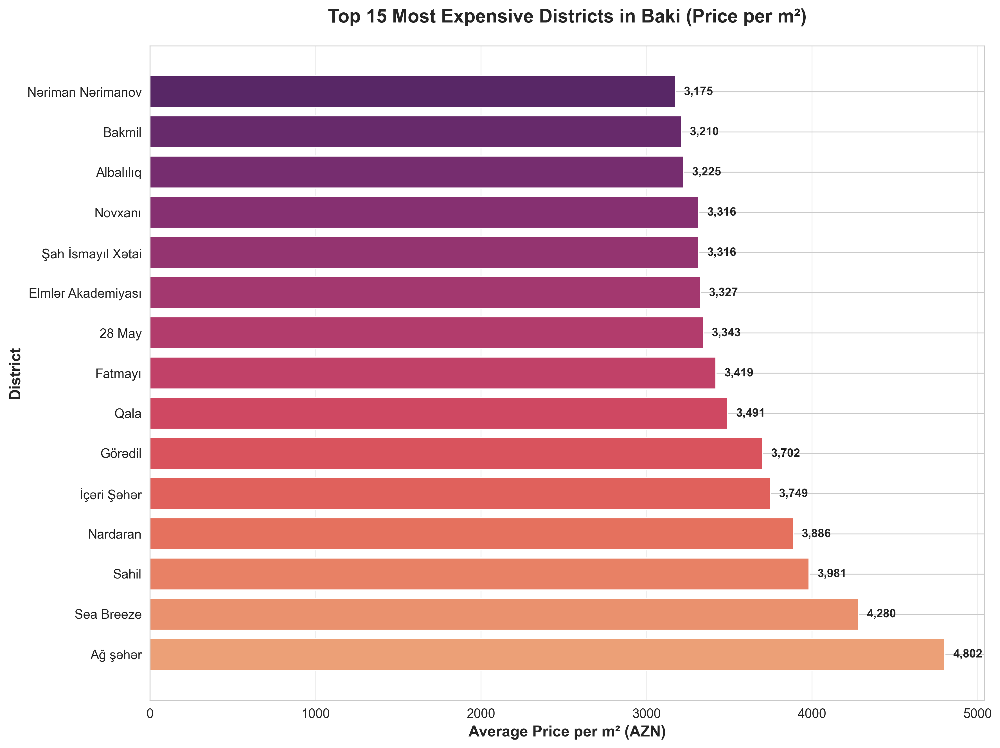

# Bina.az Property Scraper

Asynchronous web scraper for [bina.az](https://bina.az/) - Azerbaijan's largest real estate platform. Scrapes rental and sale properties with automatic category extraction.

## Features

- **Asynchronous Scraping**: Uses `asyncio` and `aiohttp` for high-performance concurrent requests
- **Category Extraction**: Automatically extracts property categories (Yeni tikili, Köhnə tikili, Obyekt, etc.) from detail pages
- **Crash Recovery**: Checkpoint system to resume from the last successful page
- **Deduplication**: Automatic detection and removal of duplicate items
- **Multi-format Export**: Saves data in JSON, CSV, and Excel (XLSX) formats
- **Performance Tracking**: Real-time ETA calculation and performance metrics
- **Data Validation**: Automatic validation and statistics reporting

## Quick Start

```bash
# Install dependencies
uv sync
# or: pip install -r requirements.txt

# Run both scrapers (interactive)
python main.py

# Run individually
python rent.py    # Scrape rental properties
python sale.py    # Scrape sale properties
```

## Output

Data is automatically saved in:
- `data/rent/bina_rent_YYYYMMDD_HHMMSS.json` - JSON format
- `data/rent/bina_rent_YYYYMMDD_HHMMSS.csv` - CSV format  
- `data/rent/bina_rent_YYYYMMDD_HHMMSS.xlsx` - Excel format
- `data/bina_sale_YYYYMMDD_HHMMSS.*` - Sale properties

## Data Fields

Each property includes:
- **Basic Info**: ID, area (m²), floor, rooms, property type
- **Location**: City, district, full location name
- **Price**: Amount (AZN) and currency
- **Features**: Mortgage option, repair status, daily payment available
- **Agent Info**: Company name, agent type (agency/individual)
- **Media**: Photo count and URLs
- **Category**: Property age/type (Yeni tikili, Köhnə tikili, Obyekt, etc.)
- **Metadata**: URL, scraped timestamp

## Configuration

Modify in `rent.py` or `sale.py`:

```python
ITEMS_PER_PAGE = 16              # Items per API request
MAX_CONCURRENT_REQUESTS = 5      # Concurrent connections
CHECKPOINT_INTERVAL = 50         # Save checkpoint every N pages
INCREMENTAL_SAVE_INTERVAL = 100  # Save backup every N pages
```

## Architecture

```
├── rent.py              # Rental property scraper
├── sale.py              # Sale property scraper
├── scraper_utils.py     # Shared utilities (category extraction)
├── main.py              # Interactive runner
├── generate_insights.py # Data analysis
└── requirements.txt     # Dependencies
```

## Performance

- **Speed**: ~100-150 items/minute
- **Concurrency**: 5 concurrent requests
- **Memory**: Efficient with incremental saves
- **Recovery**: Automatic checkpoint resume

## Logs

- `rent_scraper.log` - Rental scraper execution logs
- `scraper.log` - Sale scraper execution logs

## Error Handling

- Automatic retry on network failures
- Checkpoint recovery on crashes
- Graceful handling of missing data
- Detailed error logging
- **Sabunçu and Binəqədi** show strong growth as emerging residential areas

**Market Trend**: Central districts remain highly liquid, while peripheral areas are expanding rapidly with new developments.

---

### 3️⃣ Price vs Property Size Relationship



**Key Findings:**

- **Clear linear correlation** between property size and price
- **Average price**: ~2,200 AZN per square meter
- **Sweet spot**: 80-120 m² properties show optimal market activity
- **Larger properties** (200m²+) command premium prices but have fewer buyers

**Buyer Behavior**: Most demand concentrates in the 60-150 m² range, indicating preference for 2-3 room apartments.

---

### 4️⃣ What Buyers Are Looking For



**Key Findings:**

- **3-room apartments** are the market favorite (37.0%)
- **2-room apartments** second choice (28.9%)
- **1-room apartments** make up only 3.7% (limited supply)
- **Large properties** (5-6 rooms) represent 7% of market

**Market Gap**: Shortage of studio and 1-room apartments despite urban migration trends.

---

### 5️⃣ How Prices Scale with Property Size



**Key Findings:**

- **Linear price growth** from 1 to 5 rooms
- **Average jump**: ~100K AZN per additional room
- **1-room**: 140K AZN → **6-room**: 650K AZN
- **Best value**: 3-room apartments offer optimal size-to-price ratio

**Investment Strategy**: 3-room properties provide the best balance between affordability and resale potential.

---

### 6️⃣ Property Features & Buyer Preferences



**Key Findings:**

**Mortgage Availability:**

- **40.1%** of properties support mortgage financing
- **59.9%** require full cash payment
- Mortgage access improving but still limited

**Renovation Status:**

- **86.9%** of properties are already renovated
- **13.1%** need repair or renovation
- Buyers strongly prefer move-in ready properties

**Market Insight**: High percentage of renovated properties indicates competitive market where sellers invest in presentation.

---

### 7️⃣ Market Price Segmentation



**Key Findings:**

- **100K-200K range** dominates the market (28,500 properties)
- **Middle-class segment** (100K-300K) represents 60% of market
- **Luxury segment** (500K+) accounts for 12% of listings
- **Entry-level** (under 50K) very limited (2,800 properties)

**Affordability**: Most of the market caters to middle-income buyers, with limited options for first-time buyers.

---

### 8️⃣ Leading Real Estate Agencies



**Key Findings:**

- **Market concentration**: Top 15 agencies control significant market share
- **Leader agencies** maintain 400-600 active listings each
- **"Əmlak ofisi"** leads with the most diverse portfolio
- **Professional market**: 71% of all listings managed by agencies

**Market Structure**: Highly professionalized market with established agency networks dominating over individual sellers.

---

### 9️⃣ VIP Listings Premium Analysis



**Key Findings:**

- **VIP Premium**: VIP listings command a significant price premium over regular listings
- **Market Share**: VIP listings represent only 3.8% of total market
- **Average Prices**: Clear price differential between VIP and regular properties
- **Median Comparison**: Both average and median prices show consistent premium pattern

**Marketing Insight**: VIP promotion is strategically used for higher-value properties, demonstrating effective market segmentation and premium positioning strategy.

---

### 🔟 Most Expensive Districts (Price per m²)



**Key Findings:**

- **Nəsimi** leads at 2,800+ AZN/m² (city center premium)
- **Xətai and Yasamal** follow closely at 2,500+ AZN/m²
- **Suburban districts** 40-50% cheaper per square meter
- **Price range**: 1,500-3,000 AZN/m² across different districts

**Location Value**: Central districts command significant premiums, but peripheral areas offer better value per square meter.

---

## 📈 Market Statistics Summary

| Metric                              | Value       |
| ----------------------------------- | ----------- |
| **Total Properties Analyzed** | 72,446      |
| **Cities Covered**            | 83          |
| **Average Price**             | 340,450 AZN |
| **Average Area**              | 153.5 m²   |
| **Average Price/m²**         | 2,217 AZN   |
| **Properties with Mortgage**  | 37.4%       |
| **Renovated Properties**      | 81.1%       |
| **Business Listings**         | 71.1%       |
| **VIP Listings**              | 3.8%        |

---

## 🎓 Key Takeaways for Investors

### 🟢 Opportunities

1. **Growing Peripheral Districts**: Sabunçu, Binəqədi offer value with growth potential
2. **3-Room Apartments**: Highest liquidity and demand
3. **Renovated Properties**: Premium positioning worth the investment
4. **Resort Markets**: Qəbələ, Şamaxı showing strong pricing power

### 🟡 Market Trends

1. **Professionalization**: Agencies dominate, ensuring market transparency
2. **Mortgage Gap**: Limited mortgage availability constrains market growth
3. **Quality Focus**: Market prefers renovated, ready-to-move properties
4. **Central Premium**: Location remains the primary price driver

### 🔴 Challenges

1. **Entry-Level Shortage**: Limited affordable housing for first-time buyers
2. **Cash Market**: 60% of sales require full payment
3. **Market Concentration**: Heavy focus on Bakı limits regional development

---

## 📁 Data Quality Report

- ✅ **Dataset Completeness**: 93%
- ✅ **Price Data**: 100% complete
- ✅ **Location Data**: 94.2% complete
- ✅ **Property Details**: 100% complete
- ✅ **Photos Available**: 100% of listings

**Data Source**: Bina.az GraphQL API

**Collection Date**: November 17, 2025

**Properties Scraped**: 72,446

**Data Integrity**: Zero duplicates, validated records only

---

## 🔍 Methodology

This analysis was conducted using:

- **Automated data collection** via Bina.az API
- **Statistical analysis** of 72,446 property listings
- **Data validation** and quality checks
- **Visual analytics** across 10 key dimensions

All charts generated using Python (matplotlib, seaborn) with professional styling and statistical rigor.

---

## 📞 About This Analysis

**Purpose**: Strategic market intelligence for real estate investors, developers, and analysts

**Coverage**: Comprehensive snapshot of Azerbaijan's residential property market

**Frequency**: Point-in-time analysis (November 2025)

---

<div align="center">

**🏆 Azerbaijan Real Estate Market Analysis 2025**

*Data-driven insights for smarter real estate decisions*

</div>
# bina_az_scrape

